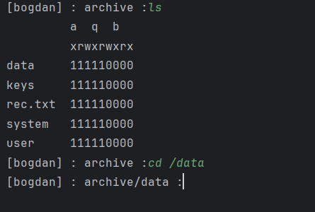

# Задача
#####  Разработать эмулятор для языка оболочки ОС. Необходимо сделать работу эмулятора как можно более похожей на сеанс shell в UNIX-подобной ОС. Эмулятор должен запускаться из реальной командной строки, а файл с виртуальной файловой системой не нужно распаковывать у пользователя. Эмулятор принимает образ виртуальной файловой системы в виде файла формата zip. Эмулятор должен работать в режиме CLI.
##### Конфигурационный файл имеет формат yaml и содержит:

1) Имя пользователя для показа в приглашении к вводу.

2) Путь к архиву виртуальной файловой системы.

3) Путь к лог-файлу.
Лог-файл имеет формат json и содержит все действия во время последнего сеанса работы с эмулятором. Для каждого действия указан пользователь.
Необходимо поддержать в эмуляторе команды ls, cd и exit, а также следующие команды:
1. chmod.
2. history.
3. wc.

Все функции эмулятора должны быть покрыты тестами, а для каждой из поддерживаемых команд необходимо написать 3 теста.

# Результат работы

## Тестирование всех функций прошло успешно 